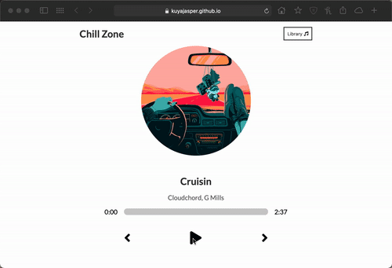

# Music Player

## Description:

The purpose of this project was to create a music player similar to popular music applications like Apple Music or Spotify.

I utilized React Hooks, and Props.

## License:

## Development:

This personal project was bootstrapped with the[Create React App](https://github.com/facebook/create-react-app).

The resources for this project came from [DevEd](https://developedbyed.com/)

The music used for this application are sourced from [Chill Hop](https://chillhop.com/) which has copy right free music.

## Screen Recording:

Example of how deployed application should run:

# Deployed Application: [Click Here](https://kuyajasper.github.io/react-music-player/)

## Questions:

Reach out at:

